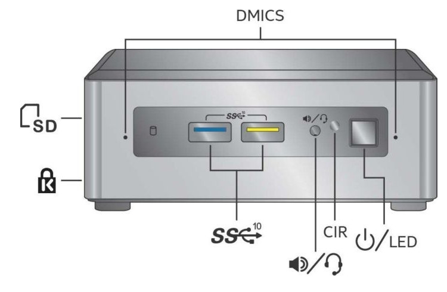
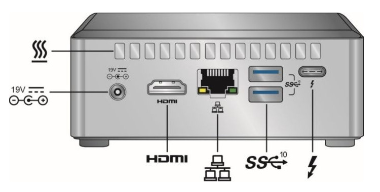
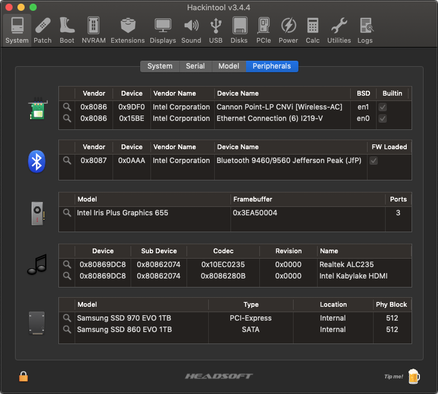
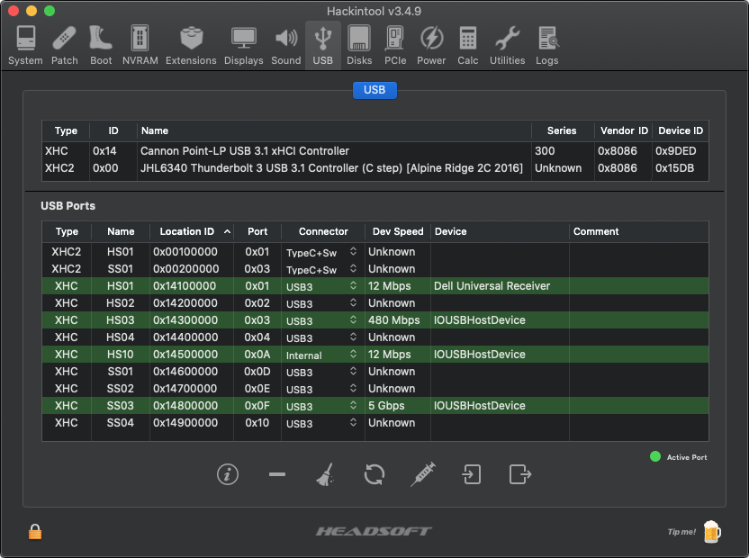
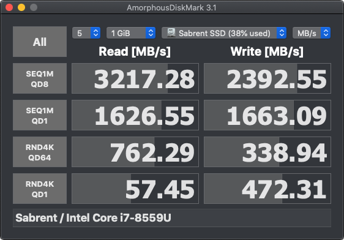
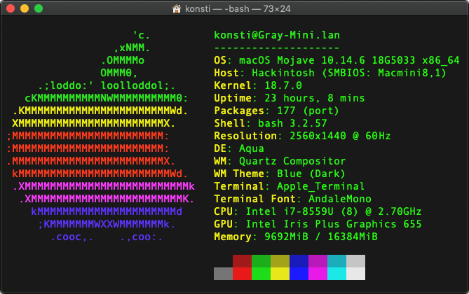
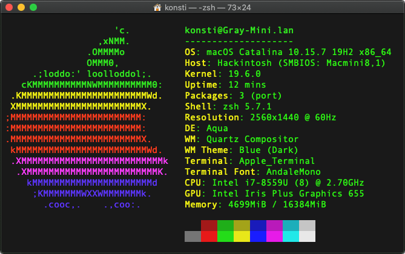
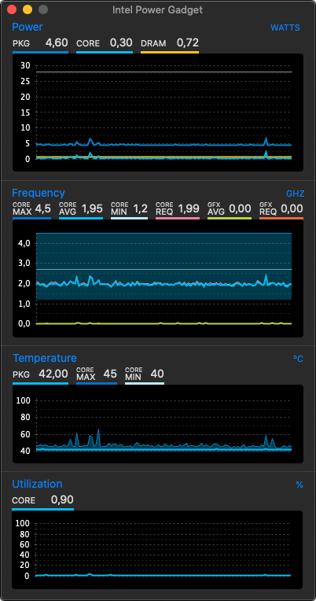

# Intel NUC Model NUC8i7BEH

This repository contains personal work and files, developed and maintained for a successful use with [Clover EFI bootloader](https://github.com/CloverHackyColor/CloverBootloader/) on this specific Intel NUC model. There are **no** ready, pre-packaged EFI solutions provided; instead, the needed configuration and ACPI files are published for those interested in studying the code, while creating their own bootloader configurations.

## Platform Generation

* Sandy Bridge = All Core ix-3xxx (HD Graphics 3000)
* Ivy Bridge = All Core ix-3xxx (HD Graphics 4000)
* Haswell = All Core ix-4xxx (HD Graphics 4600)
* Broadwell = All Core ix-5xxx (Iris Pro Graphics 6200)
* Skylake = All Core ix-6xxx (HD Graphics 5xx)
* Kaby Lake = All Core ix-7xxx (UHD/Iris Plus Graphics 6xx)
* **Coffee Lake = All Core ix-8xxx (UHD/Iris Plus Graphics 6xx)**

## Generation Details: Bean Canyon (2018)

**Specifications:** 
https://ark.intel.com/products/126140/Intel-NUC-Kit-NUC8i7BEH

**Downloads:** 
https://downloadcenter.intel.com/product/126140/Intel-NUC-Kit-NUC8i7BEH

**BIOS Recovery & Update Instructions:** 
https://www.intel.com/content/www/us/en/support/articles/000005532/mini-pcs.html

**BIOS Corruption Clear CMOS:** 
https://www.intel.com/content/www/us/en/support/articles/000005805/mini-pcs.html

## Generation Details: Coffee Lake (2018)

**CPU:** Intel Core i7-8559U @ 2.70 GHz up to 4.50 GHz / 4 Cores / 8 Threads

**GPU:** Intel Iris Plus Graphics 655 / 300 MHz up to 1.20 GHz

**URL:** https://ark.intel.com/products/137979/Intel-Core-i7-8559U-Processor-8M-Cache-up-to-4-50-GHz

## Geekbench

**V4 Scores:** https://browser.geekbench.com/v4/cpu/search?q=Core+i7-8559U

**V5 Scores:** https://browser.geekbench.com/v5/cpu/search?q=Core+i7-8559U

## Product Overview

## Compatible Models

Mac Model: iMac16,2 
CPU: i7-5675R @ 3.10 GHz up to 3.60 GHz / 4 Cores / 8 Threads 
GPU: Intel Iris Pro 6200 
Everymac: https://everymac.com/ultimate-mac-lookup/?search_keywords=iMac16,2 
Board ID: FFE5EF870D7BA81A 
BIOS Revision: IM162.88Z.0221.B00.1809171530 

Mac Model: iMac18,1 
CPU: i5-7360U @ 2.30 GHz up to 3.60 GHz / 2 Cores / 4 Threads 
GPU: Iris Plus Graphics 640 
Everymac: https://everymac.com/ultimate-mac-lookup/?search_keywords=iMac18,1 
Board ID: 4B682C642B45593E 
BIOS Revision: IM181.88Z.F000.B00.1809171524

Mac Model: **Macmini8,1** 
CPU: i7-8700B @ 3.20 GHz up to 4.60 GHz / 6 Cores / 12 Threads 
GPU: Intel UHD Graphics 630 
Everymac: https://everymac.com/ultimate-mac-lookup/?search_keywords=Macmini8,1 
Board ID: 7BA5B2DFE22DDD8C 
BIOS Revision: MM81.88Z.F000.B00.1809171422 
BIOS Revision: MM81.88Z.F000.B00.1907261958 
BIOS Revision: MM81.88Z.F000.B00.2001052107 
BIOS Revision: MM81.88Z.F000.B00.2005132145 
BIOS Revision: MM81.88Z.F000.B00.2101062036 

## Current Setup

**Memory:** 16GB in 2 x 8GB SO-DIMM (1.2V) 
**RAM:** Kingston HyperX "Impact" DDR4 @ 2400MHz CL14 (Model HX424S14IB2/8) 
**WLAN:** Intel Dual-Band Wireless-AC 9560 (Embedded Module) [[8086:9df0]](http://pci-ids.ucw.cz/read/PC/8086/9df0) 
**BTLE:** Intel Bluetooth 5.1 (Embedded Module) [8087:0aaa] 
**NVMe:** Samsung EVO 970 NVMe M.2 1TB (Model MZ-V7E1T0BW) [[144d:a808]](https://pci-ids.ucw.cz/read/PC/144d/a808) 
**NVMe:** Sabrent Rocket NVMe M.2 512GB (Model SB-ROCKET-512) [[1987:5012]](https://pci-ids.ucw.cz/read/PC/1987/5012) 
**SSD:** Samsung EVO 860 SATA 1TB (Model MZ-76E1T0B/EU) 
**Thunderbolt:** Intel JHL6340 Thunderbolt 3 Controller (Alpine Ridge 2C 2016) [[8086:15db]](https://pci-ids.ucw.cz/read/PC/8086/15db) 
**Intel Product Compatibility Tool:** https://compatibleproducts.intel.com/ProductDetails?EPMID=126140 

## Wireless Connectivity

The embedded 802.11ac wireless 9560 chipset [8086:9df0] has been working without issues with [itlwm](https://github.com/OpenIntelWireless/itlwm) since Mojave. The controller can be enabled in BIOS, and for aesthetic reasons, can be renamed from `Device (CNVW)` to `(WLAN)` via Clover patching. As for the embedded BTLE module, Intel reports it being a Bluetooth 5.1 device, which works in _most_ cases with [IntelBluetoothFirmware](https://github.com/OpenIntelWireless/IntelBluetoothFirmware) since Mojave, too. Both drivers can be loaded through Clover.

## Required BIOS Settings

For the most basic but _required_ BIOS settings, as well as previous firmware releases, see [BIOS](BIOS/) folder.

## Active Configuration

* No CPU ID faking required, power management is native; MSR `0xE2` remains locked;
* External USB 3.0 ports work as expected; using generated `USBPorts.kext`;
* Internal USB 2.0 headers not used; they are disabled in BIOS;
* External USB-C port works for display purposes; special USB-C to miniDP cable used;
* Intel graphics acceleration works as `0x3EA50004` with [WhateverGreen](https://github.com/acidanthera/whatevergreen/releases);
* Analogue audio output works as layout ID `0x03` with [AppleALC](https://github.com/acidanthera/AppleALC/releases/);
* Digital audio output works with `FakePCIID.kext` and the HDMI Audio extension;
* Embedded Intel LAN interface works with [IntelMausi](https://github.com/acidanthera/IntelMausi/releases);
* Embedded Intel WLAN module works with [OpenIntelWireless](https://github.com/OpenIntelWireless/itlwm/releases);
* Embedded Intel BTLE module detected with [IntelBluetoothFirmware](https://github.com/OpenIntelWireless/IntelBluetoothFirmware/releases);
* Integrated SD Card reader is not compatible; it is disabled in BIOS;
* Sleep/Wake both work without issues; see "Power" section in [Hackintool](https://github.com/headkaze/Hackintool/releases);
* Both NVMe and SSD SATA interfaces work with no effort nor kext needed.

For the complete list of all detected PCI hardware components and their respective addresses via `lspci -nn` command (in Ubuntu, loaded via USB) see [here](Various/lspci-nn.txt). This list was created with all devices enabled in BIOS and is used as a device "map" so that PCI IDs can be detected before tweaking the hardware (and BIOS) to run macOS.

## Intel Iris Plus Graphics 655 Properties

The `AAPL,ig-platform-id` property set to `0x3EA50004` is used for **WhateverGreen** to successfully enable acceleration on this graphics device [[8086:3ea5]](http://pci-ids.ucw.cz/read/PC/8086/3ea5). This ID represents the following properties and connectors:

| Properties             | Value(s)                               |
| ---------------------- | -------------------------------------- |
| Platform ID            | 0x3EA50004                             |
| Device ID              | 0x3EA58086                             |
| Mobile                 | Yes                                    |
| Stolen Memory          | 57 MB                                  |
| Framebuffer Memory     | 0 MB                                   |
| Video Memory (VRAM)    | 1536 MB                                |
| Total Stolen Memory    | 58 MB                                  |
| Total Cursor Memory    | 1 MB                                   |
| Maximum Stolen Memory  | 172 MB                                 |
| Maximum Overall Memory | 173 MB                                 |
| Model name             | Iris Plus Graphics 655                 |
| Camellia (V3)          | Disabled                               |
| Connector Count        | 3                                      |
| Pipe / Port #1         | Bus ID `0x06` Pipe `8`  Connector LVDS |
| Pipe / Port #2         | Bus ID `0x05` Pipe `9`  Connector DP   |
| Pipe / Port #3         | Bus ID `0x04` Pipe `10` Connector DP   |

Read more at [Intel® HD Graphics FAQs](https://github.com/acidanthera/WhateverGreen/blob/master/Manual/FAQ.IntelHD.en.md) on the **WhateverGreen** repository.

## USB Port Mapping on NUC Chassis

| USB 2.0 Port Name | USB 3.0 Port Name | Hardware Location  | Controller     |
| ----------------- | ----------------- | ------------------ | -------------- |
| HS01              | SS01              | Front RIGHT socket | Primary XHCI   |
| HS02              | SS02              | Front LEFT socket  | Primary XHCI   |
| HS03              | SS03              | Rear TOP socket    | Primary XHCI   |
| HS04              | SS04              | Rear BOTTOM socket | Primary XHCI   |
| HS10              | N/A               | Internal BTLE port | Primary XHCI   |
| HS01              | SS01              | Rear USB-C socket  | Secondary XHCI |

The above active and working USB ports are listed in Hackintool when the two *internal* (USB 2.0) headers and **Consumer IR** are all _disabled_ in [BIOS](BIOS/) and when **all unused or non-referenced USB ports** are removed. In any other situation, ports such as HS05, HS06, HS07, HS08, HS09, USR1, USR2, SS05 and SS06 may be listed. All ports above are defined in `USBPorts.kext` according to their _electrical_ connector.

